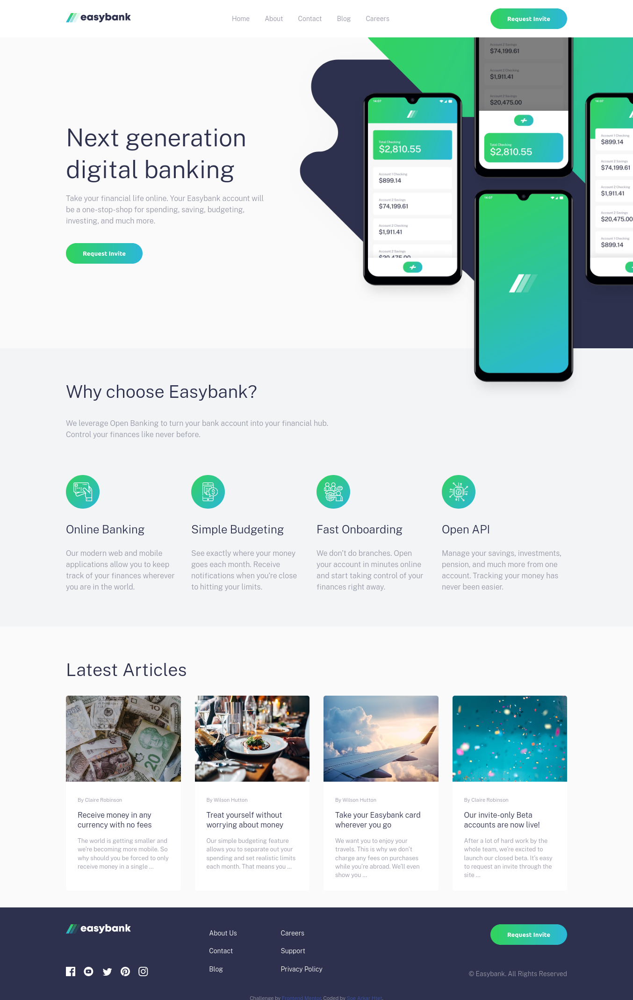

# Frontend Mentor - Easybank landing page solution

This is a solution to the [Easybank landing page challenge on Frontend Mentor](https://www.frontendmentor.io/challenges/easybank-landing-page-WaUhkoDN). Frontend Mentor challenges help you improve your coding skills by building realistic projects. 

## Table of contents

- [Overview](#overview)
  - [Links](#links)
- [My process](#my-process)
  - [Built with](#built-with)
  - [Useful resources](#useful-resources)
- [Author](#author)
- [Acknowledgments](#acknowledgments)

## Overview

### The challenge

Users should be able to:

- View the optimal layout for the site depending on their device's screen size
- See hover states for all interactive elements on the page

### Screenshot

### Links

- Solution URL: [Add solution URL here](https://your-solution-url.com)
- Live Site URL: https://easybank-landing-page-mu-sandy.vercel.app/

## My process

### Built with

- Semantic HTML5 markup
- SCSS
- JavaScript
- Flexbox
- CSS Grid
- Mobile-first workflow

### Useful resources

- [Build a website from scratch - Frontend Mentor EasyBank landing page](https://www.youtube.com/playlist?list=PLUWqFDiirlsuYscECzks6zIZWr_Cfcx9k) - This is an amazing playlist which helped me to understand responsive, frontend, mobile-first workflow and some CSS properties.
- [Version Control with Git](https://www.udacity.com/course/version-control-with-git--ud123) - This 
course helped me to know basic knowledge of git and how to write a good commit message.
- [W3 Schools](https://www.w3schools.com/) This is an amazing website for who is learning about web development.

## Author

- Frontend Mentor - [@SArkar-Htet](https://www.frontendmentor.io/profile/SArkar-Htet)
- Facebook - [Soe Arkar Htet](https://www.facebook.com/soearkar.htet.526)

## Acknowledgments

I saw this challenge from [Build a website from scratch - Frontend Mentor EasyBank landing page](https://www.youtube.com/playlist?list=PLUWqFDiirlsuYscECzks6zIZWr_Cfcx9k) on youtube. I watched all the videos of this [playlist](https://www.youtube.com/playlist?list=PLUWqFDiirlsuYscECzks6zIZWr_Cfcx9k) and wrote the code. So, she ([Coder Coder](https://www.youtube.com/c/TheCoderCoder)) helped me everything of this challenge.